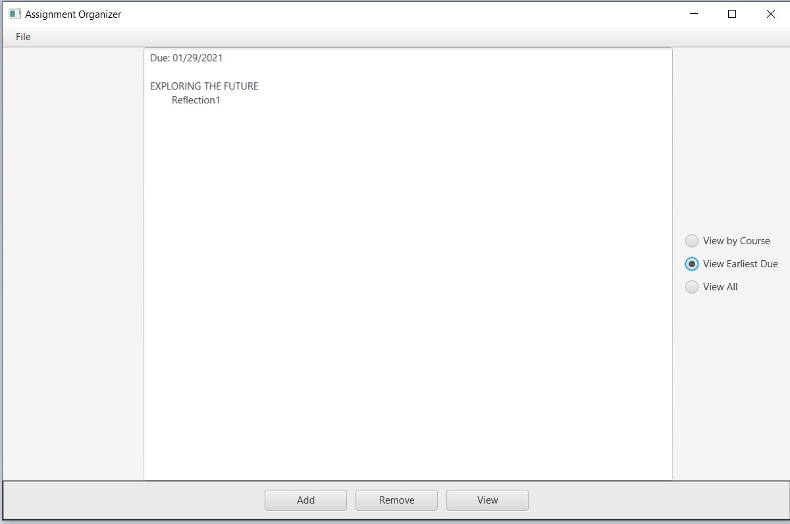
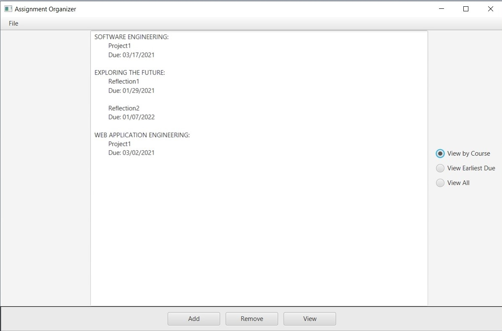
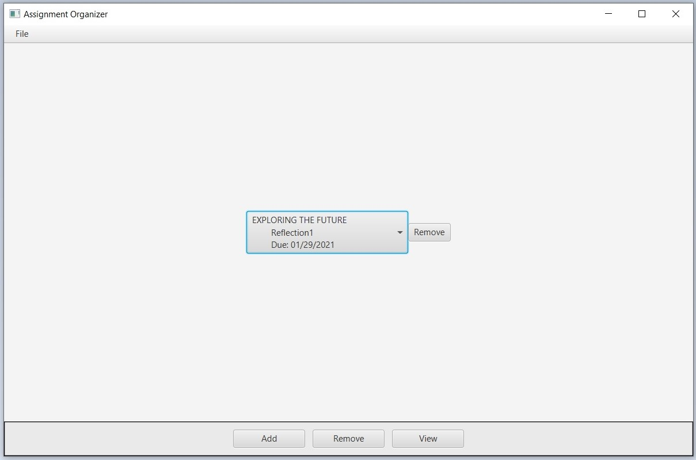
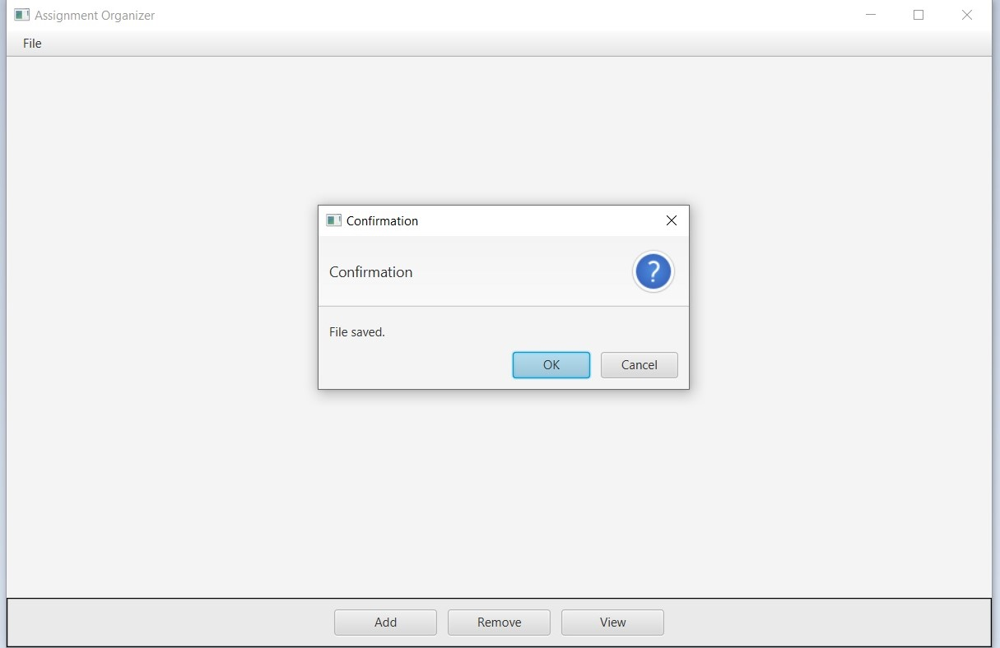

#Assignment Organizer

This application keeps track of assignments.

This is the start screen.

To add an assignment, enter the assignment name, the course name,  and the due date. 

After courses have been added, they can be viewed by due date or by course.

To remove an assignment, highlight the assignment and select remove.

Don't forget to save!